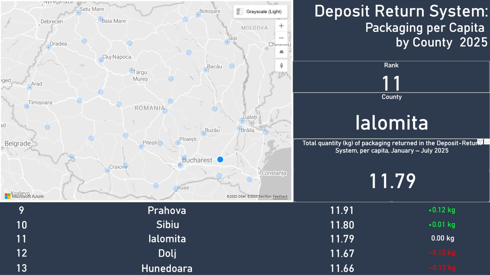
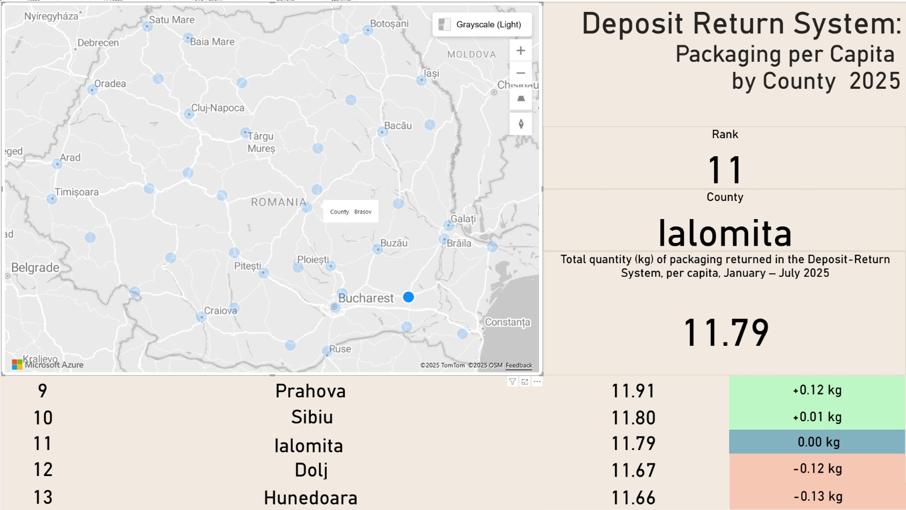

# DataTribe_Challenge_Sept_2025_ZGB

## General Context of this report

This project was created as part of the **RomanianDATA Tribe Challenge**, from September 2025. 

The main theme was : *highlight county-level patterns in packaging returned per capita across Romania*.  


##Datasource and Originial Report:

## References

The initial report that served as a starting point for this challenge:  
[Click to see the dashboard](https://cumstam.ro/grafice/1280)

The data source link:  
[Click here](https://data.world/romanian-data/deposit-return-system-packaging-per-person-2025)

> **Note:** I do not own any of the reports or datasets linked above.  
> Full credit goes to their respective developers and data providers.


## Project Overview

My main idea was to go in another direction from the original report and explore **how counties compare with their neighbors**, in order to see how close, or how far apart, they really are.  


Example of key insights from my home county, **Ialomița**:
- The gap with **Sibiu** is minimal,  just a few cans per person.  
- Differences with **Prahova** and **Dolj** are more visible, around 120 grams per person.
- Overall, **Ialomița ranks close to the Top 10**, showing strong participation in the deposit return system.







## Technical Details

This was also my first deeper dive into **Power BI** for storytelling with data.  

- Built a few simple **custom DAX metrics**.  
- Designed in both **light and dark themes** to explore how readability changes with style.  
- Includes an **interactive map** where values from the other cards update dynamically as you explore different counties.  


These design choices showed me how much **presentation impacts the story** behind the numbers (And also how much Power Bi has to offer as a visualization tool). 

## How to Use
1. Clone this repository:  
   ```bash
   git clone https://github.com/<your-username>/<repo-name>.git

2. Explore the report! :)

> Note1: Since I’m still a beginner with Power BI, I wanted to build dynamically changing elements. To achieve this, I couldn’t rely on a single table alone, I created a custom-like table with cards, each using its own DAX formula.
> Note2: To make the dataset easier to work with, I added an index column in the original Excel file to count the rows.

## Feedback
If you have any recommendations for improvement, or critiques of my color theme choices, please open an issue.  
I’ll gladly review them and explore improvements.
